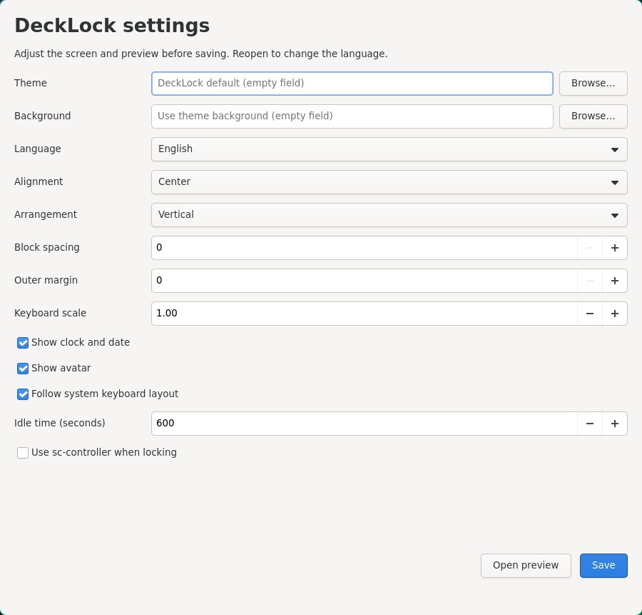
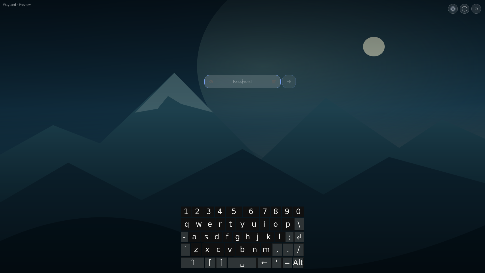

# DeckLock

**English** · [Português (Brasil)](README.pt-BR.md)

### A customizable Wayland lock screen, built with Rust and GTK4.

External CSS themes, image and video backgrounds, an embedded keyboard, and a
native settings window. Designed for Wayland desktops, with optional controller
support for devices such as the Steam Deck.


*Actual preview recording with a looping video, visible pointer clicks, embedded keyboard,
Caps Lock indicator, password visibility and power tooltips. Fictitious password; the session is not locked.*

## Configure visually

```sh
scripts/cargo-local run -- --settings
```

Choose a theme and background, set the language, move the clock and credentials,
change spacing and keyboard scale, and adjust idle time. **Open preview** displays
your current edits without saving. **Save** writes your user configuration without
changing the theme files. The editor supports English and Brazilian Portuguese.



This first editor uses controls for existing layout options. Freeform dragging,
live theme reload and plugins are future work.

## Try it

Development dependencies: Rust 1.93+, GTK4 4.12+, GStreamer development libraries
with base/good and GL plugins, Linux-PAM, pkg-config and gtk4-layer-shell 1.3+.
Video formats depend on the installed codecs.

```sh
git clone https://github.com/yan-vidal/DeckLock.git
cd DeckLock
cargo run -- --preview --locale en-US --preview-fullscreen
```

If your distribution does not provide gtk4-layer-shell 1.3+, build it locally
(requires Meson, Ninja, a C compiler, Wayland and wayland-protocols):

```sh
scripts/bootstrap-native
scripts/cargo-local run -- --preview --locale en-US --preview-fullscreen
```

The bootstrap verifies the download's SHA-256 and installs only into `.deps/`.
Use `cargo` directly with system libraries, or `scripts/cargo-local` with the local
build. With no arguments, DeckLock opens a preview.

**Preview never authenticates, locks the session or executes power actions.**
Press Escape to hide the keyboard, then Escape again to close the window.

## Embedded keyboard

```sh
scripts/cargo-local run -- --preview --keyboard --locale en-US
```



Mouse, physical keyboard and optional controller input share the same password
field. Double-tap Shift to latch it; tap again to release. The keyboard reads the
first GDK keymap group at startup and offers supplementary Alt symbols when the
system layout has no AltGr layer.

To test the optional external sc-controller daemon:

```sh
scripts/cargo-local run -- --preview --controller --locale en-US
# From another terminal or a desktop shortcut:
scripts/cargo-local run -- --toggle-keyboard
```

Controller mode reveals keys near the fingers. Capture is released when the
keyboard closes. Preview only enables this integration with an explicit
`--controller` or `--controller-socket` argument; the settings editor's preview
never captures a controller. Existing installed `deck-osk --toggle` shortcuts
remain compatible.

## Themes and configuration

Open `--settings` or copy [config.example.toml](config.example.toml) to
`~/.config/decklock/config.toml`. Use `--config PATH` for another configuration.
GUI layout choices are stored under `[layout]` and take precedence over the theme's
layout. Remove that section to inherit theme defaults again. Existing PAM settings
are preserved when saving through the editor.

Themes contain `theme.toml` and `style.css`; no recompilation is needed.

```sh
scripts/cargo-local run -- --preview --theme themes/contrast
scripts/cargo-local run -- --preview --background docs/assets/wallpaper.svg
scripts/cargo-local run -- --check-config --config config.example.toml
```

- [Theme guide](docs/themes.md) — CSS selectors and layout options (Portuguese).
- [Translation guide](docs/i18n.md) — Fluent catalogs and language fallback (Portuguese).
- [Implementation status](docs/rust-migration.md) — verification and remaining gaps (Portuguese).

`scripts/import-python-theme` optionally converts legacy local colors and media
into an external theme. Python is used by that one-time importer and development
test scripts; the application and native shortcut run in Rust.

## Status and compatibility

**Experimental.** Real locking requires an explicit `--lock` and a compositor
that implements `ext-session-lock-v1`. Wayland alone does not guarantee support;
X11 is outside the scope of this project.

Preview and settings have been tested on Hyprland. An isolated compositor test
covers lock acquisition, monitor hotplug, SIGTERM without unlock and rejection
of a second locker after the first exits. Real-session PAM, broader compositor
coverage, controller recovery and haptics still need validation. Test in your
environment before replacing an existing system locker.

Rust is the implementation on `main`. The previous Python application remains in
[Git history](https://github.com/yan-vidal/DeckLock/tree/7459bb1).

## Development checks

```sh
scripts/cargo-local test --locked
scripts/cargo-local fmt --all -- --check
scripts/cargo-local clippy --locked --all-targets -- -D warnings
scripts/cargo-local build --locked
scripts/cargo-local run --locked --example settings_check
scripts/cargo-local run --locked --example preview_check
python3 scripts/test-controller-shortcut.py
scripts/bootstrap-native --tests
python3 scripts/test-lock-isolated.py
```

GUI tests use temporary configuration and preview windows. Protocol tests use a
separate Wayland socket and never lock the desktop session in use.

## Media folders and idle mode

On startup DeckLock creates `~/.config/midias/bloqueio/{fotos,videos}` and
`~/.config/midias/ocioso/{fotos,videos}` (respecting `XDG_CONFIG_HOME`).
It chooses a supported image or video from these folders when no background is
specified. Explicit configuration takes priority over the theme and default folders.
An empty idle folder falls back to the normal background. The settings editor can
select separate normal and idle files; TOML paths can also name a media folder.

Idle time controls DeckLock's own visual idle mode, not system suspension.
Power buttons delegate to `systemctl suspend`, `hibernate`, `reboot`, and `poweroff`;
the host supplies permissions and working sleep/hibernate configuration.
Preview buttons only show tooltips and never execute these commands.
Procedural backgrounds are not currently implemented; backgrounds are images or
looping, muted videos supported by the installed GStreamer codecs.
