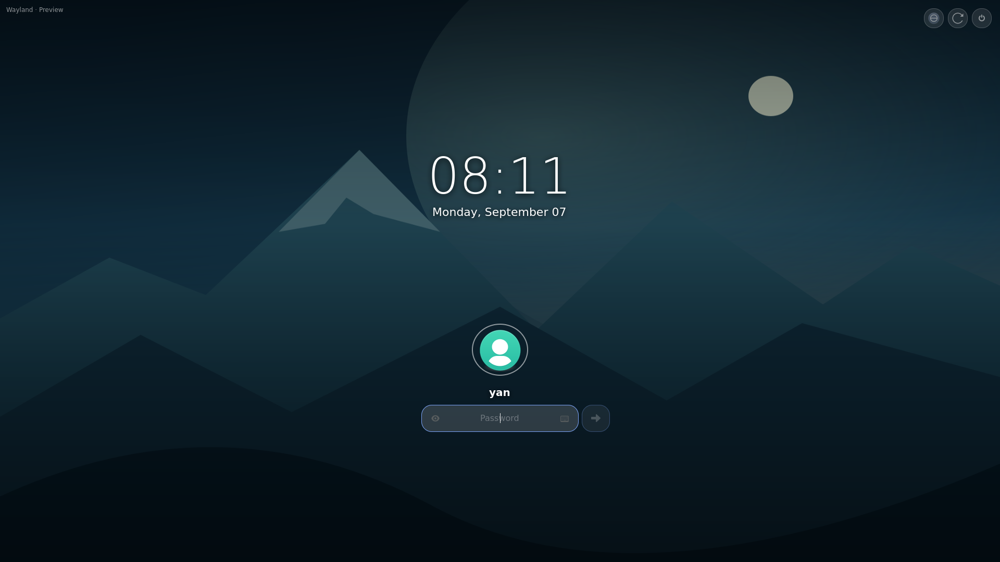

# DeckLock

[English](README.md) · **Português (Brasil)**

### Uma tela de bloqueio personalizável para Wayland, feita com Rust e GTK4.

Temas CSS externos, fundos com imagens e vídeos, teclado integrado e uma janela
nativa de configurações. Voltado a desktops Wayland, com suporte opcional a
controles em dispositivos como o Steam Deck.



*Captura real do aplicativo em modo preview. A sessão não está bloqueada.*

## Configure pela interface

```sh
scripts/cargo-local run -- --settings --locale pt-BR
```

Escolha tema e fundo, idioma, posição do relógio e das credenciais, espaçamentos,
escala do teclado e tempo de inatividade. **Abrir preview** mostra as alterações
atuais sem salvar. **Salvar** grava sua configuração sem modificar os arquivos do
tema. A interface está disponível em português e inglês.


Esta primeira interface oferece controles para as opções de layout existentes.
Arrastar elementos livremente, recarregar temas ao editar e plugins ficam para
etapas futuras.

## Experimente

Dependências de desenvolvimento: Rust 1.93+, GTK4 4.12+, bibliotecas de
desenvolvimento do GStreamer com plugins base/good e GL, Linux-PAM, pkg-config e
gtk4-layer-shell 1.3+. Os formatos de vídeo dependem dos codecs instalados.

```sh
git clone https://github.com/yan-vidal/DeckLock.git
cd DeckLock
cargo run -- --preview --locale pt-BR --preview-fullscreen
```

Se a distribuição não oferecer gtk4-layer-shell 1.3+, compile localmente
(requer Meson, Ninja, compilador C, Wayland e wayland-protocols):

```sh
scripts/bootstrap-native
scripts/cargo-local run -- --preview --locale pt-BR --preview-fullscreen
```

O bootstrap verifica o SHA-256 do download e instala apenas em `.deps/`.
Use `cargo` diretamente com bibliotecas do sistema, ou `scripts/cargo-local` com
a compilação local. Sem argumentos, o DeckLock também abre um preview.

**O preview nunca autentica, bloqueia a sessão nem executa ações de energia.**
Pressione Esc para esconder o teclado e novamente para fechar a janela.

## Teclado integrado

```sh
scripts/cargo-local run -- --preview --keyboard --locale pt-BR
```


Mouse, teclado físico e controle opcional usam o mesmo campo de senha. Dois toques
no Shift travam o modificador; outro toque destrava. O teclado consulta o primeiro
grupo do mapa GDK ao abrir e oferece símbolos suplementares no Alt quando o mapa
do sistema não tem uma camada AltGr.

Para testar o daemon externo opcional sc-controller:

```sh
scripts/cargo-local run -- --preview --controller --locale pt-BR
# Em outro terminal ou em um atalho do desktop:
scripts/cargo-local run -- --toggle-keyboard
```

No modo controle, as teclas aparecem próximas dos dedos. Fechar o teclado libera
a captura. O preview só habilita essa integração com `--controller` ou
`--controller-socket` explícito; o preview da janela de configurações nunca
captura o controle. Atalhos antigos `deck-osk --toggle` já instalados continuam
compatíveis.

## Temas e configuração

Abra `--settings` ou copie [config.example.toml](config.example.toml) para
`~/.config/decklock/config.toml`. Use `--config CAMINHO` para outro arquivo.
As escolhas visuais da interface ficam em `[layout]`, com prioridade sobre o tema.
Remova essa seção para voltar aos padrões do tema. Configurações existentes de
PAM e fundo ocioso são preservadas ao salvar pela interface.

Temas contêm `theme.toml` e `style.css`; não é preciso recompilar.

```sh
scripts/cargo-local run -- --preview --theme themes/contrast
scripts/cargo-local run -- --preview --background docs/assets/wallpaper.svg
scripts/cargo-local run -- --check-config --config config.example.toml
```

- [Guia de temas](docs/themes.md) — seletores CSS e opções de layout.
- [Guia de tradução](docs/i18n.md) — catálogos Fluent e idiomas alternativos.
- [Estado da implementação](docs/rust-migration.md) — verificações e pendências.

`scripts/import-python-theme` pode converter cores e mídias locais da versão
antiga em um tema externo. Python é usado nesse importador pontual e em scripts
de teste; o aplicativo e seu comando de atalho executam em Rust.

## Estado e compatibilidade

**Experimental.** O bloqueio real exige `--lock` explícito e um compositor com
`ext-session-lock-v1`. Wayland, por si só, não garante esse suporte; X11 está fora
do escopo do projeto.

Preview e configurações foram testados no Hyprland. Um compositor isolado verifica
aquisição do bloqueio, entrada/saída de monitores, SIGTERM sem desbloquear e recusa
de um segundo bloqueador após a saída do primeiro. PAM na sessão real, outros
compositores, recuperação do controle e vibração ainda precisam de validação.
Teste no seu ambiente antes de substituir um bloqueador já configurado.

Rust é a implementação da `main`. O aplicativo Python anterior permanece no
[histórico do Git](https://github.com/yan-vidal/DeckLock/tree/7459bb1).

## Verificações de desenvolvimento

```sh
scripts/cargo-local test --locked
scripts/cargo-local fmt --all -- --check
scripts/cargo-local clippy --locked --all-targets -- -D warnings
scripts/cargo-local build --locked
scripts/cargo-local run --locked --example settings_check
scripts/cargo-local run --locked --example preview_check
python3 scripts/test-controller-shortcut.py
scripts/bootstrap-native --tests
python3 scripts/test-lock-isolated.py
```

Os testes de interface usam configuração temporária e janelas de preview. Os
testes de protocolo usam outro socket Wayland e nunca bloqueiam a sessão em uso.
