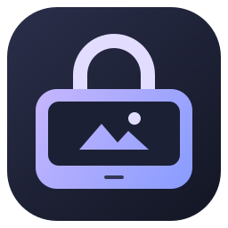
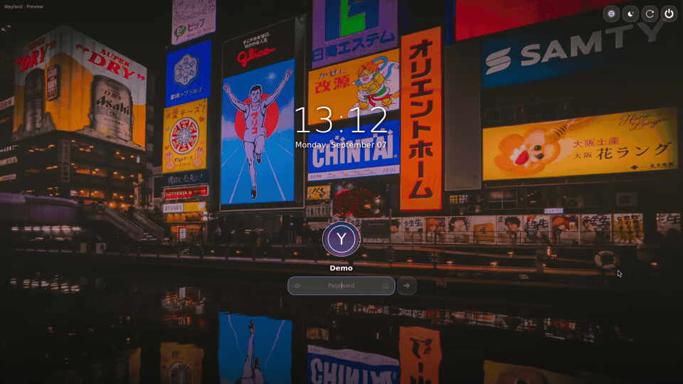
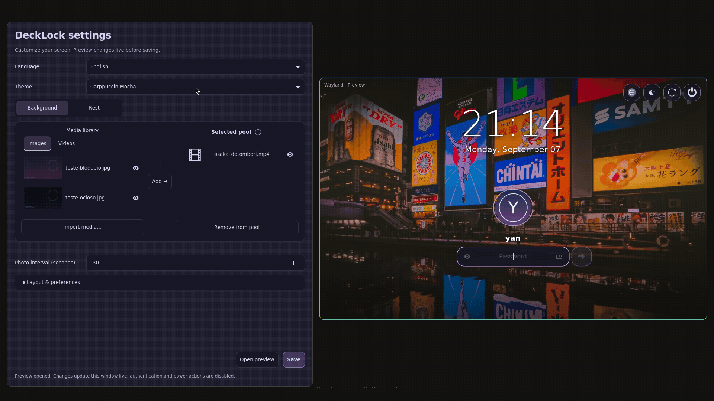
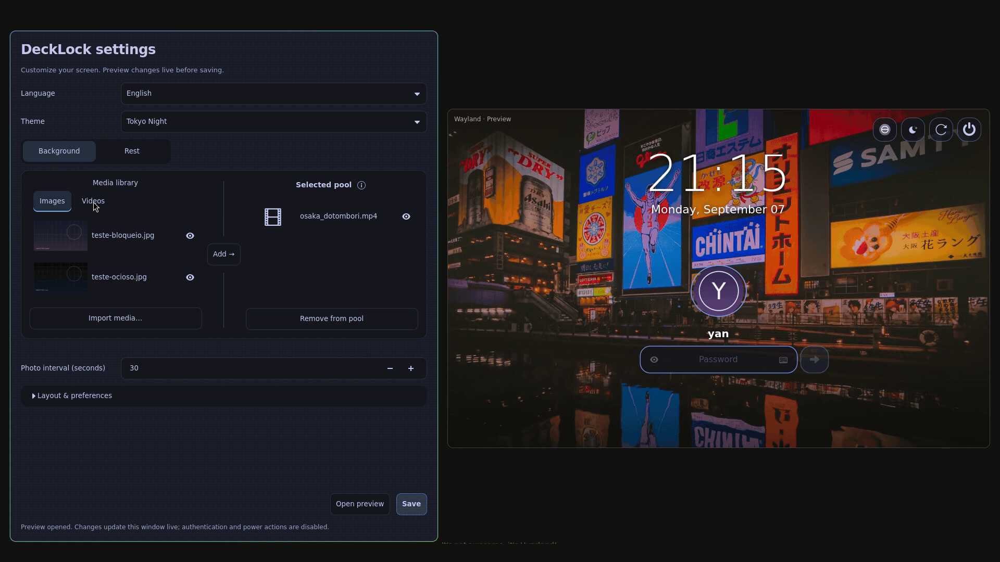
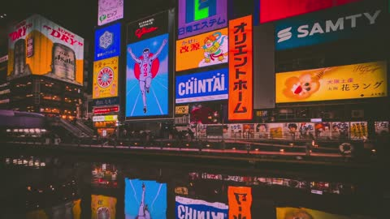
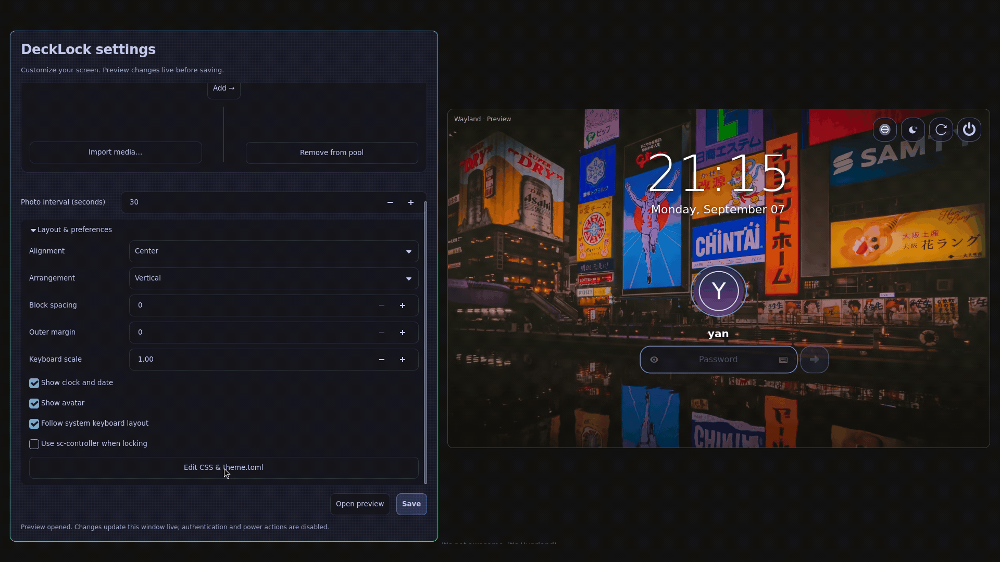

<p align="center"></p>

# DeckLock

[English](README.md) · **Português (Brasil)**

Uma **tela de bloqueio para Wayland** personalizável, feita em Rust e GTK4. Temas
externos, fundos com fotos e vídeos, teclado integrado e configuração visual nativa.
Suporte opcional a controles, incluindo dispositivos como o Steam Deck.



## Instalação

### Arch Linux · x86_64

Baixe o pacote **0.1** no [GitHub Releases](https://github.com/yan-vidal/DeckLock/releases/tag/v0.1-r2),
ou use:

```sh
curl -fLO https://github.com/yan-vidal/DeckLock/releases/download/v0.1-r2/decklock-0.1-2-x86_64.pkg.tar.zst
curl -fLO https://github.com/yan-vidal/DeckLock/releases/download/v0.1-r2/SHA256SUMS
sha256sum --check --ignore-missing SHA256SUMS
sudo pacman -Syu
sudo pacman -U ./decklock-0.1-2-x86_64.pkg.tar.zst
```

O pacote instala o aplicativo, o atalho **Configurações do DeckLock** e as mídias
incluídas. O pacman resolve as dependências de execução; não é necessário instalar
Rust. O download vem do GitHub, não do AUR nem dos repositórios oficiais do Arch.

Abra **Configurações do DeckLock** no menu de aplicativos ou execute:

```sh
decklock --settings
```

### Outras distribuições Linux

O DeckLock não é exclusivo do Arch. Precisa de GTK4, GStreamer, Linux-PAM e
`gtk4-layer-shell` 1.3+, além de um compositor Wayland com `ext-session-lock-v1`
para bloquear a sessão. X11 não é suportado.

O binário pronto da versão 0.1 usa as bibliotecas do **Arch x86_64 atual**; ele não
é um binário universal para Linux. Ainda não fornecemos pacotes para outras
distribuições ou arquiteturas. Para elas, veja [compilação](#desenvolvimento).


## Mídias procedurais (branch de desenvolvimento; previstas para 0.2)

Esses recursos ainda não fazem parte da versão 0.1 publicada.

Abra **Fundo → Biblioteca → Procedurais**. Selecione **Campo de estrelas**,
**Partículas flutuantes** ou **Curvas de Lissajous** e adicione ao pool como uma foto
ou vídeo. O procedural substitui o fundo; não é uma camada sobre outra mídia.
Se for sorteado no bloqueio, permanece durante aquela sessão. Fotos continuam
alternando apenas entre fotos. Repouso tem seu próprio pool; **Reutilizar o fundo**
mantém a mídia normal.

O **olho** abre a mídia no visualizador único. A **engrenagem** ajusta as cores,
velocidade, quantidade de partículas, seed e FPS (1–30) daquele item. **Aplicar**
atualiza o rascunho e as prévias abertas; **Salvar** nas configurações grava no disco.
Fechar o editor sem aplicar descarta suas edições. Os parâmetros valem para todos
os pools que usam o item; removê-lo do pool mantém suas configurações.

```sh
decklock config set background_pool '["procedural:starfield"]'
decklock config set procedurals.starfield.color '#b4befe'
decklock config set procedurals.starfield.speed 1.0
decklock config set idle_pool '["procedural:lissajous"]'
decklock config set idle_reuse_background false
decklock --preview
```

IDs: `procedural:starfield`, `procedural:particles`, `procedural:lissajous`,
`procedural:matrix` e `procedural:doom-fire`.
As tabelas TOML individuais ficam em `[procedurals.starfield]` (e nos outros IDs).
`config unset procedurals` restaura os parâmetros. Nenhum código de terceiros é
executado. A textura opaca tem até 640 pixels no maior lado e é ampliada para a
janela. Widgets ocultos deixam de solicitar quadros. Economia de bateria ainda
não foi medida. Veja a [configuração de exemplo](config.example.toml).


## Preview e bloqueio

```sh
decklock --preview                 # Experimentar sem bloquear
decklock --preview --keyboard      # Mostrar o teclado integrado
decklock --lock                    # Bloquear explicitamente a sessão
```

Sem argumentos, `decklock` mostra a ajuda. Use `decklock --help` ou
`decklock config --help` para comandos e exemplos. O preview não autentica nem
executa ações de energia. Escape oculta o teclado e, depois, fecha a janela.

**A versão 0.1 é experimental.** Preview e configurações foram testados no Hyprland.
Testes de protocolo isolados cobrem aquisição do bloqueio, mudanças de monitores e
encerramento sem desbloquear. PAM na sessão real e uma variedade maior de
compositores/controles ainda precisam de validação antes de substituir seu bloqueador.

## Temas e idioma

Escolha Classic, Catppuccin Mocha/Latte, Dracula, Nord, Tokyo Night ou Gruvbox.
As cores mudam nas configurações e no preview aberto imediatamente, sem reiniciar
o vídeo quando muda apenas a paleta. O seletor de idioma alterna entre português
e inglês sem descartar alterações não salvas.



O fundo da configuração tem uma trama sutil de tecido, controlada pelo CSS.
Os controles mantêm superfícies legíveis. **Abrir preview** mostra alterações ainda
não salvas; **Salvar** grava a configuração.

## Biblioteca de fundos

À esquerda fica a **biblioteca de mídias**; à direita, o **pool selecionado**.
Use as abas Fotos/Vídeos, selecione um item e clique em **Adicionar →**. Remover do
pool não apaga o arquivo. A dica do ⓘ explica o sorteio. O olho abre um único
visualizador reutilizável para imagens e vídeos sem som.



Cada bloqueio sorteia um item do pool. Um vídeo permanece em loop naquela sessão;
uma foto inicia um slideshow com transições entre as fotos do pool, no intervalo
configurado. **Importar mídias** copia arquivos para `~/.local/share/decklock/library`
(ou `$XDG_DATA_HOME/decklock/library`) sem sobrescrever nomes existentes.

## Mídias incluídas

A instalação padrão inclui este vídeo original de **Yan Vidal**. Clique na miniatura
para abrir o arquivo. Outras fotos e vídeos autorais serão adicionados nas próximas
versões.

[](assets/media/videos/osaka_dotombori.mp4)

**Osaka Dōtonbori** · vídeo · 1920×1080 · 10 segundos · reproduzido em loop e sem som no DeckLock.
[Créditos e notas de distribuição](assets/media/CREDITS.md).

O pacote fica em `/usr/share/decklock/media`, fora do executável Rust. Em uma
instalação nova, fornece o fundo padrão. Atualizações preservam suas importações
e pools selecionados. Fundos configurados explicitamente continuam tendo prioridade.
Veja o [guia do pacote de mídias](assets/media/README.md) para adicionar novas obras.

## Repouso

Selecione a aba **Repouso** para ver essa aparência no preview aberto. Configure o
tempo de inatividade, um pool independente e o intervalo entre fotos, ou mantenha
o fundo normal e oculte os controles. **Desativar modo ocioso** esconde todas as
opções dependentes e preserva seus valores. **Fundo** retorna ao preview normal.


O relógio permanece visível por padrão, inclusive ao reutilizar o fundo normal.
O tema pode mudar isso com `[layout] idle_clock_visible = false`. Esse é o modo de
inatividade visual do próprio DeckLock; ele não suspende o computador.

## Layout e CSS personalizado

Expanda **Layout e preferências** para alterar alinhamento, espaçamento, margens,
escala do teclado e visibilidade. **Editar CSS e theme.toml** abre o editor ao vivo:
o CSS controla a aparência e o TOML, as opções de layout suportadas.



Edições válidas aparecem ao vivo. Rascunhos inválidos mantêm a última aparência
válida e não podem ser salvos. Salvar cria uma cópia editável na sua pasta de
configuração sem sobrescrever o tema original. Não exige recompilação.

As opções ficam em `~/.config/decklock/config.toml`. `--config CAMINHO` seleciona
outro arquivo. Valores de `[layout]` da interface sobrescrevem os padrões do tema.
A configuração existente do PAM é preservada. [Exemplo](config.example.toml).

- [Temas e créditos das paletas](themes/README.md)
- [Seletores CSS e guia de layout](docs/themes.md)
- [Guia de tradução](docs/i18n.md)

## Configuração pelo terminal

Todos os campos de configuração também podem ser alterados pelo binário, sem abrir
janelas GTK, com a mesma validação e gravação atômica da interface:

```sh
decklock                          # Ajuda e exemplos
decklock config --help
decklock config path
decklock config show
decklock config get idle_seconds
decklock config set theme_preset catppuccin-mocha
decklock config set locale pt-BR
decklock config set idle_seconds 120
decklock config set idle_reuse_background true
decklock config set layout.padding 48
decklock config set layout.idle_clock_visible false
decklock config set background_pool '["/caminho/foto.jpg", "/caminho/video.mp4"]'
decklock config unset layout       # Voltar ao layout do tema
decklock config import ./minha-config.toml
```

`set` aceita números, booleanos, listas/tabelas TOML e texto simples. Campos
desconhecidos ou valores inválidos são rejeitados sem alterar o arquivo. `unset`
restaura o padrão do campo; em campos opcionais, restaura a herança.
Use `--config CAMINHO` para trabalhar em outro arquivo:

```sh
decklock --config ./demo.toml config set idle_enabled false
```

Temas personalizados continuam sendo arquivos `style.css` e `theme.toml`: edite-os
no seu editor de terminal e escolha a pasta com `decklock config set theme /caminho/do/tema`. `decklock config unset theme` volta às paletas incluídas.
Os comandos alteram o arquivo salvo; reabra um bloqueio/preview existente para
carregá-lo. O preview ao vivo da interface acompanha os controles não salvos dela.

## Teclado e energia

Mouse, teclado físico e controle opcional usam o mesmo campo de senha. Toque duas
vezes em Shift para ativar Caps Lock; toque novamente para liberar. Alt oferece
símbolos extras quando o layout do sistema não tem AltGr. O teclado usa o primeiro
grupo do mapa de teclas GDK na inicialização.

O daemon externo sc-controller é opcional:

```sh
decklock --preview --controller
# Em outro terminal ou atalho:
decklock --toggle-keyboard
```

O preview das configurações nunca captura um controle. No preview normal, a
integração exige `--controller` ou `--controller-socket` explícito. Atalhos antigos
`deck-osk --toggle` continuam compatíveis. Fechar o teclado libera a captura.

Os botões de energia chamam `systemctl suspend`, `hibernate`, `reboot` e `poweroff`.
As permissões e o funcionamento da suspensão/hibernação dependem do sistema.
No preview, os botões só mostram dicas. Fundos procedurais e plugins ainda não
estão implementados; a reprodução depende dos codecs GStreamer instalados.

## Verificações automáticas

Cada PR executa a suíte completa e gera um pacote Arch de teste no GitHub. A main
exige verificações aprovadas; releases públicos são compilados e validados a partir
de tags de versão após o merge. Veja [cobertura e limites](docs/testing.md) e
[regras para agentes](AGENTS.md).

## Desenvolvimento

Requer Rust 1.93+, arquivos de desenvolvimento do GTK4 4.12+, bibliotecas GStreamer
base/good/GL e codecs, Linux-PAM, pkg-config e gtk4-layer-shell 1.3+. No Arch:

```sh
sudo pacman -S --needed base-devel rust gtk4 gtk4-layer-shell gstreamer gst-plugins-base gst-plugins-good gst-libav pam
git clone https://github.com/yan-vidal/DeckLock.git
cd DeckLock
cargo build --release --locked
cargo run -- --settings
```

Se a distribuição não fornece gtk4-layer-shell 1.3+, o bootstrap local precisa de
Meson, Ninja, compilador C, Wayland e wayland-protocols:

```sh
scripts/bootstrap-native
scripts/cargo-local build --release --locked
scripts/cargo-local run -- --preview
```

O bootstrap verifica o arquivo fixado por hash e instala somente em `.deps/`.

### Verificações

```sh
scripts/cargo-local test --locked
scripts/cargo-local fmt --all -- --check
scripts/cargo-local clippy --locked --all-targets -- -D warnings
scripts/cargo-local run --locked --example settings_check
scripts/cargo-local run --locked --example settings_live_check
scripts/cargo-local run --locked --example preview_check
scripts/cargo-local run --locked --example media_check
python3 scripts/test-controller-shortcut.py
scripts/bootstrap-native --tests
python3 scripts/test-lock-isolated.py
```

Os testes gráficos usam configurações temporárias. Os de protocolo usam outro
socket Wayland e nunca bloqueiam a sessão ativa. Os GIFs mostram a interface GTK
real; a instrumentação move o ponteiro antes de aplicar cada ação.

### Gerar pacotes de release

```sh
python3 scripts/package-release.py
cd dist
makepkg --nodeps
sha256sum decklock-*.pkg.tar.zst >> SHA256SUMS
```

Isso empacota o binário otimizado junto de `assets/media`, sem instalar nem ativar
um bloqueador na máquina de compilação. A receita Arch registra os requisitos de
execução do build. [Detalhes do empacotamento](packaging/README.md).

O aplicativo roda em Rust; Python é usado apenas por ferramentas de desenvolvimento
e pelo importador opcional de temas antigos. A versão anterior permanece no
[histórico Git](https://github.com/yan-vidal/DeckLock/tree/7459bb1).
[Estado da implementação](docs/rust-migration.md).
