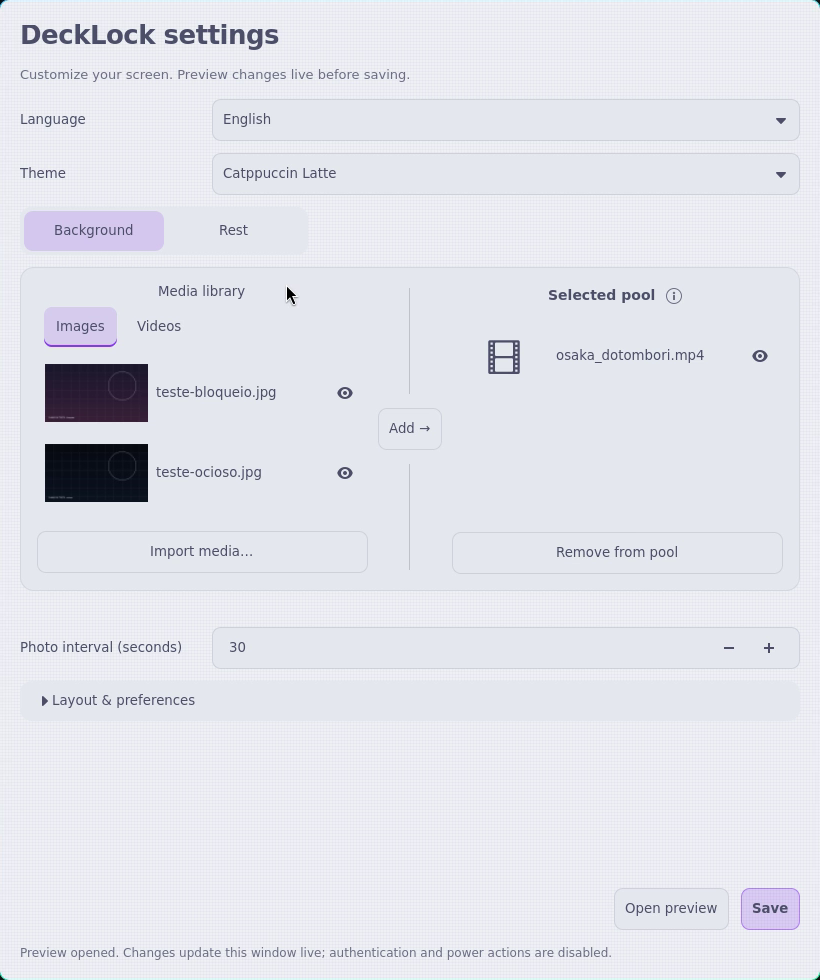
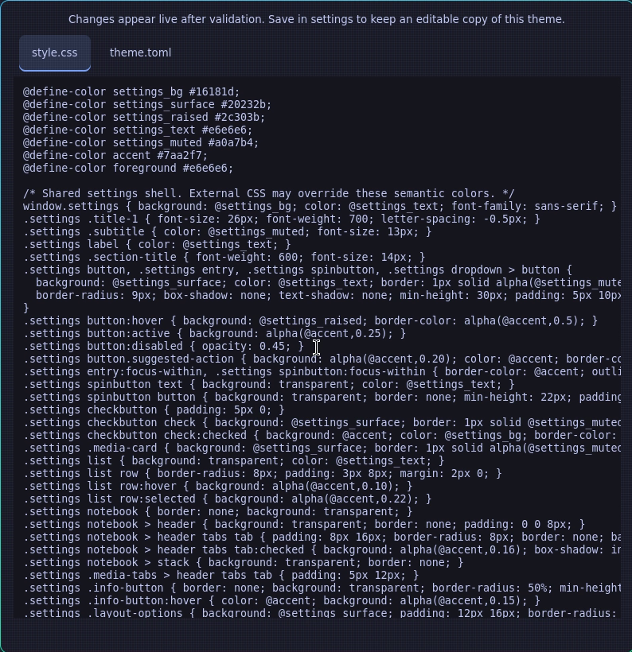
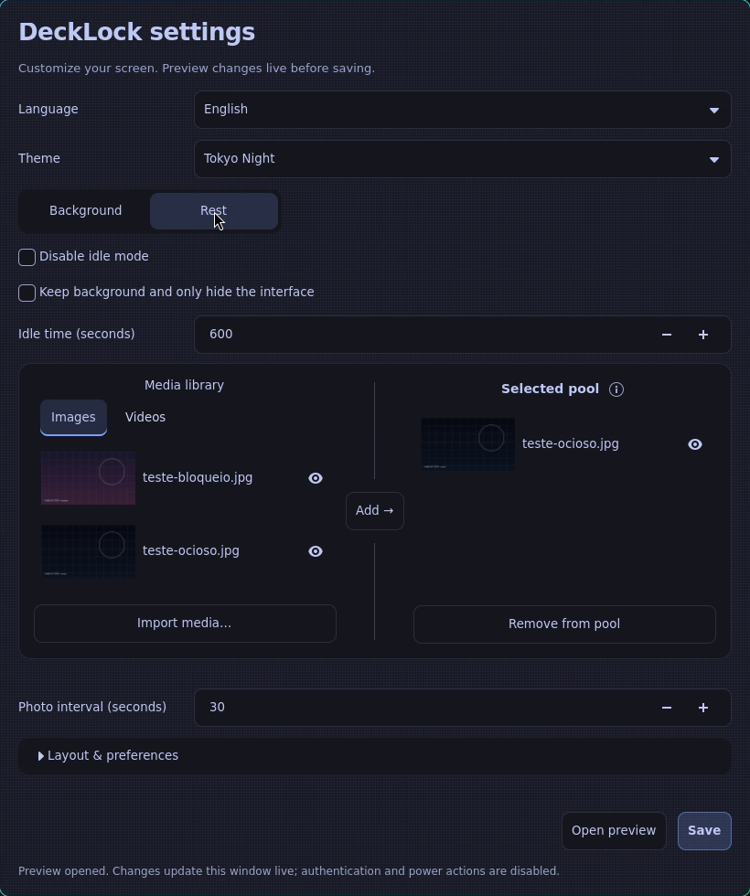
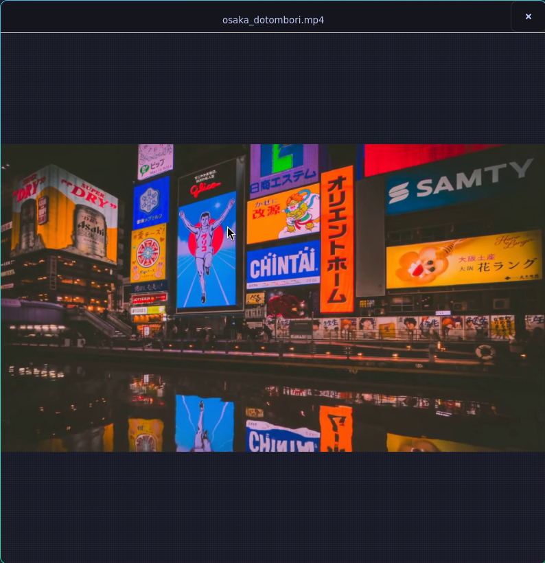

# DeckLock

[English](README.md) · **Português (Brasil)**

### Uma tela de bloqueio personalizável para Wayland, feita com Rust e GTK4.

Temas CSS externos, fundos com imagens e vídeos, teclado integrado e uma janela
nativa de configurações. Voltado a desktops Wayland, com suporte opcional a
controles em dispositivos como o Steam Deck.


*Gravação real do preview com vídeo em loop, ponteiro e cliques visíveis, teclado
integrado, Caps Lock, revelação da senha e dicas dos botões. Senha fictícia; a sessão não está bloqueada.*

## Configure pela interface

```sh
scripts/cargo-local run -- --settings --locale pt-BR
```

Escolha tema e fundo, idioma, posição do relógio e das credenciais, espaçamentos,
escala do teclado e tempo de inatividade. **Abrir preview** mostra as alterações
atuais sem salvar. **Salvar** grava sua configuração sem modificar os arquivos do
tema. A interface está disponível em português e inglês.


*Demonstração das configurações: troca dinâmica de temas com contraste aprimorado, atualização do preview em tempo real, gerenciamento de pools com visualizador modal e editor integrado de CSS e theme.toml.*

A interface conta com atualização do preview em tempo real, visualização de mídias e editor integrado para CSS e layout do tema (`theme.toml`) com validação de rascunhos. Arrastar elementos livremente e plugins ficam para etapas futuras.

## Experimente

Dependências de desenvolvimento: Rust 1.93+, GTK4 4.12+, bibliotecas de
desenvolvimento do GStreamer com plugins base/good e GL, Linux-PAM, pkg-config e
gtk4-layer-shell 1.3+. Os formatos de vídeo dependem dos codecs instalados.

```sh
git clone https://github.com/yan-vidal/DeckLock.git
cd DeckLock
cargo run -- --preview --locale pt-BR --preview-fullscreen
```

Se a distribuição não oferecer gtk4-layer-shell 1.3+, compile localmente
(requer Meson, Ninja, compilador C, Wayland e wayland-protocols):

```sh
scripts/bootstrap-native
scripts/cargo-local run -- --preview --locale pt-BR --preview-fullscreen
```

O bootstrap verifica o SHA-256 do download e instala apenas em `.deps/`.
Use `cargo` diretamente com bibliotecas do sistema, ou `scripts/cargo-local` com
a compilação local. Sem argumentos, o DeckLock também abre um preview.

**O preview nunca autentica, bloqueia a sessão nem executa ações de energia.**
Pressione Esc para esconder o teclado e novamente para fechar a janela.

## Teclado integrado

```sh
scripts/cargo-local run -- --preview --keyboard --locale pt-BR
```


Mouse, teclado físico e controle opcional usam o mesmo campo de senha. Dois toques
no Shift travam o modificador; outro toque destrava. O teclado consulta o primeiro
grupo do mapa GDK ao abrir e oferece símbolos suplementares no Alt quando o mapa
do sistema não tem uma camada AltGr.

Para testar o daemon externo opcional sc-controller:

```sh
scripts/cargo-local run -- --preview --controller --locale pt-BR
# Em outro terminal ou em um atalho do desktop:
scripts/cargo-local run -- --toggle-keyboard
```

No modo controle, as teclas aparecem próximas dos dedos. Fechar o teclado libera
a captura. O preview só habilita essa integração com `--controller` ou
`--controller-socket` explícito; o preview da janela de configurações nunca
captura o controle. Atalhos antigos `deck-osk --toggle` já instalados continuam
compatíveis.

## Temas e configuração

O seletor de idioma fica no topo e troca inglês/português imediatamente, preservando alterações não salvas. A aba **Repouso** mostra esse estado no preview aberto; **Fundo** retorna à tela normal. O relógio permanece no repouso por padrão, inclusive ao reutilizar o fundo. Para ocultá-lo, use `idle_clock_visible = false` em `[layout]` no editor de tema.

[Demonstração completa](docs/assets/settings-demo.gif) (80 segundos, 36 MiB). GIFs em **1920×1080**: [temas](docs/assets/settings-themes.gif) · [repouso](docs/assets/settings-rest.gif) · [CSS e layout](docs/assets/settings-editor.gif). O roteiro instrumentado espera o ponteiro chegar antes de cada ação, sem salvar a configuração nem bloquear a sessão.

Selecione Classic, Catppuccin Mocha/Latte, Dracula, Nord, Tokyo Night ou Gruvbox
no seletor de temas. As cores mudam imediatamente na janela de configurações e
também são aplicadas ao preview do bloqueio. Pastas de temas externos continuam aceitas.

**Fundo** e **Repouso** ficam em abas separadas. O ⓘ do pool explica o sorteio,
o slideshow de fotos e o loop do vídeo ao passar o mouse. **Layout e preferências**
expande os controles gerais abaixo da área de mídias.

Veja a [configuração de temas e os créditos das paletas](themes/README.md).



Clique em **Editar CSS e theme.toml** nas opções de layout para abrir o editor ao vivo. As alterações ficam isoladas em rascunhos temporários e são refletidas no preview assim que validadas. Salvar as configurações grava uma cópia editável em `~/.config/decklock/themes`.



Abra `--settings` ou copie [config.example.toml](config.example.toml) para
`~/.config/decklock/config.toml`. Use `--config CAMINHO` para outro arquivo.
As escolhas visuais da interface ficam em `[layout]`, com prioridade sobre o tema.
Remova essa seção para voltar aos padrões do tema. Configurações existentes de
PAM são preservadas ao salvar pela interface.

Temas contêm `theme.toml` e `style.css`; não é preciso recompilar.

```sh
scripts/cargo-local run -- --preview --theme themes/contrast
scripts/cargo-local run -- --preview --background docs/assets/wallpaper.svg
scripts/cargo-local run -- --check-config --config config.example.toml
```

- [Guia de temas](docs/themes.md) — seletores CSS e opções de layout.
- [Guia de tradução](docs/i18n.md) — catálogos Fluent e idiomas alternativos.
- [Estado da implementação](docs/rust-migration.md) — verificações e pendências.

`scripts/import-python-theme` pode converter cores e mídias locais da versão
antiga em um tema externo. Python é usado nesse importador pontual e em scripts
de teste; o aplicativo e seu comando de atalho executam em Rust.

## Estado e compatibilidade

**Experimental.** O bloqueio real exige `--lock` explícito e um compositor com
`ext-session-lock-v1`. Wayland, por si só, não garante esse suporte; X11 está fora
do escopo do projeto.

Preview e configurações foram testados no Hyprland. Um compositor isolado verifica
aquisição do bloqueio, entrada/saída de monitores, SIGTERM sem desbloquear e recusa
de um segundo bloqueador após a saída do primeiro. PAM na sessão real, outros
compositores, recuperação do controle e vibração ainda precisam de validação.
Teste no seu ambiente antes de substituir um bloqueador já configurado.

Rust é a implementação da `main`. O aplicativo Python anterior permanece no
[histórico do Git](https://github.com/yan-vidal/DeckLock/tree/7459bb1).

## Verificações de desenvolvimento

```sh
scripts/cargo-local test --locked
scripts/cargo-local fmt --all -- --check
scripts/cargo-local clippy --locked --all-targets -- -D warnings
scripts/cargo-local build --locked
scripts/cargo-local run --locked --example media_check
scripts/cargo-local run --locked --example settings_check
scripts/cargo-local run --locked --example preview_check
python3 scripts/test-controller-shortcut.py
scripts/bootstrap-native --tests
python3 scripts/test-lock-isolated.py
```

Os testes de interface usam configuração temporária e janelas de preview. Os
testes de protocolo usam outro socket Wayland e nunca bloqueiam a sessão em uso.

## Pastas de mídia e modo ocioso

Ao iniciar, o DeckLock cria `~/.config/midias/bloqueio/{fotos,videos}` e
`~/.config/midias/ocioso/{fotos,videos}` (respeitando `XDG_CONFIG_HOME`).
Sem um fundo definido, seleciona uma imagem ou vídeo dessas pastas. A configuração
explícita tem prioridade sobre o tema e as pastas padrão. Se a pasta ociosa estiver
vazia, usa o fundo normal.

O editor possui cards independentes para bloqueio e idle, divididos entre biblioteca
e pool. Use as abas Imagens/Vídeos, selecione uma mídia e clique em **Adicionar →**.
**Remover do pool** não apaga o arquivo. **Importar mídias** copia os arquivos para
`$XDG_DATA_HOME/decklock/library/{images,videos}`, sem sobrescrever nomes existentes.

Cada bloqueio sorteia uma mídia do pool: vídeo permanece em loop nessa sessão;
foto inicia um slideshow com transição suave entre apenas as fotos daquele pool,
no intervalo configurado. Bloqueio e idle possuem intervalos independentes.
Pool ocioso vazio mantém o fundo normal; pool normal explicitamente vazio fica sem
mídia. Configurações antigas com arquivo/pasta continuam aceitas até definir um pool.

**Manter o fundo e apenas ocultar a interface** oculta o card de mídias ociosas e
preserva a reprodução. **Desativar modo ocioso** oculta todas as opções dependentes, inclusive reutilização e tempo, guardando as preferências para quando reativar o idle.



Clique no ícone de olho ao lado de qualquer item da biblioteca ou do pool para abrir o visualizador único reutilizável, reproduzindo fotos ou vídeos sem som sem interromper a navegação da biblioteca.



As mídias padrão acompanham o programa como arquivos, fora do binário Rust.
Veja a [estrutura do pacote e os créditos](assets/media/README.md). O pacote está
preparado e vazio, aguardando os arquivos autorais e seus termos de redistribuição.
As importações do usuário ficam separadas das mídias do pacote.

O tempo ocioso controla o modo visual do próprio DeckLock, não a suspensão do sistema.
Os botões chamam `systemctl suspend`, `hibernate`, `reboot` e `poweroff`; permissões
e configuração funcional de suspensão/hibernação ficam por conta do sistema.
No preview, os botões só mostram dicas e nunca executam esses comandos.
Fundos procedurais ainda não estão implementados: os fundos são imagens ou vídeos
em loop, sem áudio, conforme os codecs GStreamer instalados.
